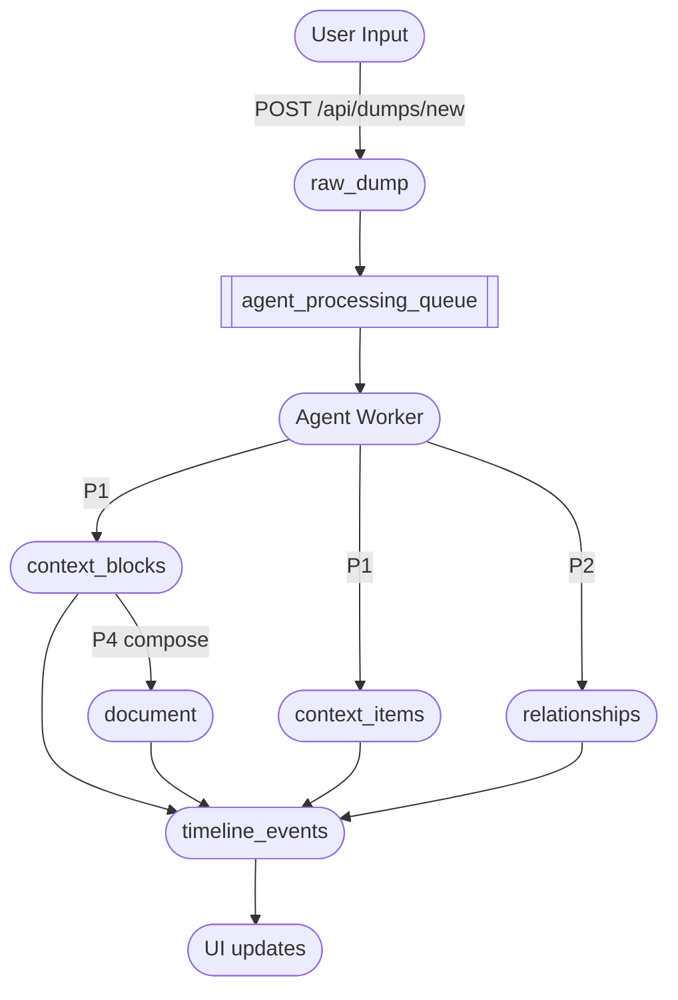

# 🧠 Yarnnn Agent System — Canon v1.4 Alignment

Version 2.2 — aligned with:
- YARNNN Canon v1.4.0 (substrate-equal, five pipelines)
- Async Intelligence Framework v2.0 (pure Supabase queue model)

Last aligned: 2025-08-28

---

## 💡 1. Philosophy: Agent ≠ Editor

Yarnnn is a **Context OS**. Agents are not editors — they are
**interpreters** and **composers** operating strictly on substrate, never
overwriting a user’s raw cognition.

---

### Core Tenets

1️⃣ **Memory-first, substrate-equal**

- `raw_dump` = immutable capture (P0)
- `context_block` = interpreted memory atom (P1)
- `context_item` = semantic connector/tag (P1)
- `reflections` = derived signals, optionally cached (P3, non-authoritative)
- `document` = deliberate narrative composition (P4)

2️⃣ **User-controlled constitution**

- Blocks evolve via lifecycle: `PROPOSED` → `ACCEPTED` → `LOCKED` → `CONSTANT`
- Agents may propose or flag, but **never silently mutate**

3️⃣ **Pipeline discipline**

- Agents operate through the five pipelines with strict write boundaries:
  - P0 Capture → dumps only
  - P1 Substrate → context_items, context_blocks (+revisions)
  - P2 Graph → relationships only
  - P3 Signals → derived, optional cache
  - P4 Presentation → documents (+joins)
- No cross-pipeline writes; events are emitted for every mutation

👉 **Outcome**: All memory remains auditable, intentional, and rooted in original cognition

---

## 🧱 2. Architecture Layers

- Frontend (Vercel): capture inputs; mirrors durable server state; never synthesizes substrate
- Agent Workers (Render): poll queue, extract substrate, map graph, emit events
- Database (Supabase): source of truth, queue, RPCs, RLS, timeline events
- Middleware (Codex CLI): local dev workflow and automation scaffold

---

## 🧠 3. Agent Categories & Naming Conventions

| Prefix | Category | Purpose |
| --- | --- | --- |
| `orch_` | Orchestration agents | P1: interpret raw_dumps → propose context_blocks; upsert context_items |
| `graph_` | Graph fabric agents | P2: materialize typed, directional relationships |
| `tasks_` | Goal agents | P4: compose documents/briefs using substrate |
| `infra_` | Infrastructure agents | Meta: contradiction scans, integrity checks, guardrails |

> ✅ All agent files end with _agent.py
>
> ✅ All agent I/O is substrate- and event-based (never text overwrite)

---

## 📂 4. Canonical Folder Structure

```
api/
└── src/
    ├── services/
    │   ├── agent_queue_processor.py   # Async queue polling loop (pure Supabase client)
    │   ├── interpretation_adapter.py  # Dump → insights/entities
    │   ├── substrate_ops.py           # Thin wrappers over P1/P2/P4 RPCs
    │   └── worker_adapter.py          # Model/runtime configs
    ├── pipelines/
    │   ├── p0_capture/
    │   ├── p1_substrate/
    │   ├── p2_graph/
    │   ├── p3_signals/
    │   └── p4_presentation/
    ├── app/
    ├── routes/
    └── utils/

```

---

## 🧩 5. Memory Contract Enforcement

| Action | Result |
| --- | --- |
| Agent proposes a block | `PROPOSED` + `event` |
| User accepts a block | `ACCEPTED` + `event` |
| User locks a block | `LOCKED` + `event` |
| Agent creates document | Output linked to blocks + narrative |
| Agent tags content | Creates/updates `context_item` |
| All changes | Tracked via `revision` + `event` |

> 🧠 raw_dumps are never modified
>
> 🧠 Only `context_blocks` evolve. `documents` compose. `context_items` link. `reflections` are derived.

---

## 🧠 6. Cognitive Roles of Agents

| Agent Category | Cognitive Function | Output Type |
| --- | --- | --- |
| `orch_` | Extraction + interpretation (P1) | `context_block`, `context_item` |
| `graph_` | Graph fabric (P2) | `relationship` events |
| `tasks_` | Composition + contextual reasoning (P4) | `document`, `brief` |
| `infra_` | Meta-reasoning + memory validation | `event`, `audit_report` |

---

## 🔁 7. Unified Flow (Async Intelligence)



---

## 🧠 8. Agent Behavior Constraints (Contracts)

- Stateless per task: Agents reason from current substrate snapshot
- Always emit events: Every change emits `timeline_events` and/or `events`
- Immutable sources: Never overwrite `raw_dump` or document inputs
- Respect block lifecycle: Only users promote memory (not agents)
- Pipeline boundaries: P0/P1/P2/P3/P4 allowed-writes only
- Pure Supabase: workers use service-role client; frontend uses anon client

### Allowed RPCs (by pipeline)
- P0: `fn_ingest_dumps`
- P1: `context_items` direct inserts (service role), `fn_block_create`, `fn_block_revision_create`
- P2: `fn_relationship_upsert_bulk`
- P3: none (optional `fn_reflection_cache_upsert`)
- P4: `fn_document_create`, `fn_document_attach_block`, `fn_document_attach_context_item`

---

## 🔭 9. Agent Roadmap

| Phase | Capability | Status |
| --- | --- | --- |
| 1 | Agent proposals + user validation | ✅ Live |
| 2 | Agent composition (docs, briefs, scaffolds) | ✅ Live |
| 3 | Async queue processing (pure Supabase workers) | ✅ Live |
| 4 | Memory health scanning + contradiction flags | 🧪 In Dev |
| 5 | Progressive UI indicators for processing states | 🧪 In Dev |
| 6 | Real-time collab + inline agent suggestions | ⏳ Planned |

---

References
- docs/YARNNN_CANON.md (v1.4.0)
- docs/YARNNN_ASYNC_INTELLIGENCE.md (v2.0)
- docs/YARNNN_SUBSTRATE_RUNTIME.md
- docs/YARNNN_GRAPH_CANON.md

Last updated 2025‑08‑28
