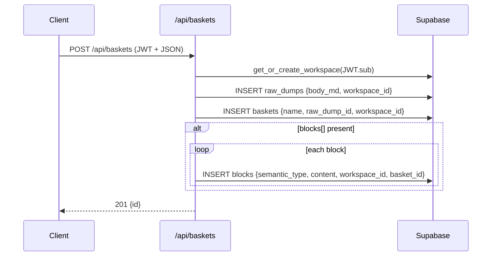

# 📄 Baskets API Contract

> **Scope:** backend ↔ frontend interface for *creating* baskets (atomic user intent capture) and the non‑negotiable rules that keep the workspace‑centric model intact.
> **Audience:** web/client devs, agent authors, Codex tasks.

---

## 0. Design Invariants 🚦

| ID      | Invariant                                                                                                                                                                             | Rationale                                                           |
| ------- | ------------------------------------------------------------------------------------------------------------------------------------------------------------------------------------- | ------------------------------------------------------------------- |
| **I‑1** | Every *row* that belongs to a workspace **must carry `workspace_id` NOT NULL**.                                                                                                       | Enables RLS policies that do *not* reference `auth.uid()` directly. |
| **I‑2** | `user_id` columns are **allowed** but *must be nullable* and treated as legacy metadata. Business logic **never** filters on them.                                                    | Prevents future code from re‑introducing direct‑user coupling.      |
| **I‑3** | All SELECT / INSERT policies for workspace tables use the same membership sub‑query:<br>`workspace_id IN (SELECT workspace_id FROM workspace_memberships WHERE user_id = auth.uid())` | Single source of truth for access rules.                            |
| **I‑4** | Clients **always send** the Supabase session JWT in the `sb-access-token` header (FastAPI) and `Authorization: Bearer` (PostgREST).                                                   | Ensures RLS can evaluate membership.                                |
| **I‑5** | No column names, enums, or view definitions in this file are *allowed* to change silently—doing so is considered a breaking change and must bump the API version.                     | Keeps front‑end & agent code stable.                                |

---

## 1. Endpoint

### 🧺 POST `/api/baskets`

Creates a new basket and its originating raw dump.

#### Required Headers

| Header            | Example            | Purpose                                                           |
| ----------------- | ------------------ | ----------------------------------------------------------------- |
| `sb-access-token` | `eyJ…`             | Supabase session – determines caller identity & workspace context |
| `Content-Type`    | `application/json` | —                                                                 |

#### JSON Body

```jsonc
{
  "topic": "Launch spring campaign",      // plain text summarising the basket
  "intent": "Drive sign‑ups via socials",  // optional higher‑level intent
  "insight": "Target Gen Z",               // optional key insight
  "blocks": [                               // optional seed blocks (≤ 25)
    {
      "semantic_type": "topic",            // required
      "label": "Launch spring campaign",   // display label
      "content": "Launch spring campaign", // canonical value
      "is_primary": true,                   // 1‑2 blocks may be primary
      "meta_scope": "basket"               // basket | workspace | global
    },
    {
      "semantic_type": "reference",
      "label": "campaign_brief.pdf",
      "content": "https://…/block_files/…/brief.pdf",
      "is_primary": true,
      "meta_scope": "basket",
      "source": "user_upload"              // user_upload | url | agent
    }
  ]
}
```

> **Payload limits**
>
> * Max **25 blocks**
> * Max **32 kB** total JSON size
> * File URLs must already exist in the `block_files` bucket.

#### Success Response `201 Created`

```json
{ "id": "uuid-of-basket" }
```

#### Error Codes

| Status | Reason                                   | Typical fix              |
| ------ | ---------------------------------------- | ------------------------ |
| `401`  | missing or expired JWT                   | login & retry            |
| `403`  | caller not a member of workspace         | request invitation       |
| `422`  | payload validation failed (see `detail`) | correct JSON             |
| `500`  | unexpected server error                  | check logs / open ticket |

---

## 2. Server‑Side Algorithm (canonical)



All writes happen inside a single Postgres transaction; rollback on any failure.

---

## 3. View `v_basket_overview` (read model)

```sql
CREATE OR REPLACE VIEW public.v_basket_overview AS
SELECT  b.*, rd.body_md AS raw_dump_body, rd.file_refs
FROM    public.baskets b
JOIN    public.raw_dumps rd ON rd.id = b.raw_dump_id
WHERE   b.workspace_id IN (
  SELECT workspace_id FROM public.workspace_memberships
  WHERE  user_id = auth.uid()
);
```

*Never* filter on `user_id` here—workspace membership is the gatekeeper.

---

## 4. Change Control 🛑

* Any modification to request/response schema, table column **names**, or view signature requires:

  1. PR that also updates **this file** 🔒
  2. Bump of `API_VERSION` constant in `/web/lib/apiVersion.ts`
  3. Migration in `/api/migrations/YYYYMMDD‑*.sql`.

Consumers must check the version header returned by the API to ensure compatibility.

---

## 5. FAQ

**Q : Why not drop `user_id` entirely?**
*A :* Historic rows still contain it; keeping the nullable column avoids a full backfill and lets analytics run simple queries.

**Q : How do agents know which workspace to operate in?**
*A :* They receive `basket.workspace_id` and must include it in any subsequent inserts. Never call `auth.uid()` from an agent.

**Q : Can blocks be created without a basket?**
*A :* Yes, but they must still carry `workspace_id`. The orchestration layer later associates them with a basket if needed.

---

*Last reviewed: 2025‑06‑21*
