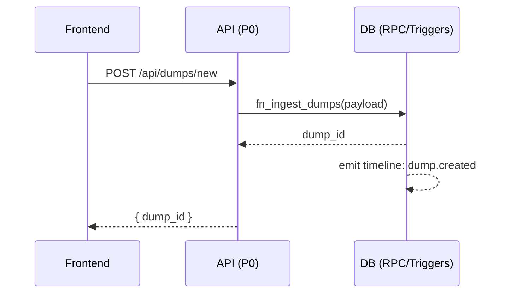
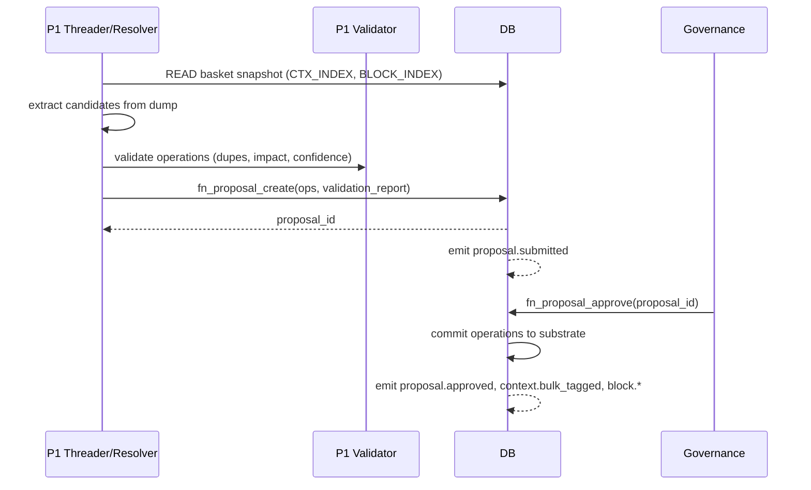
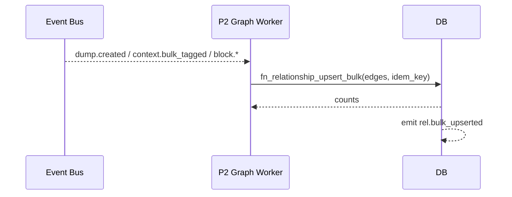
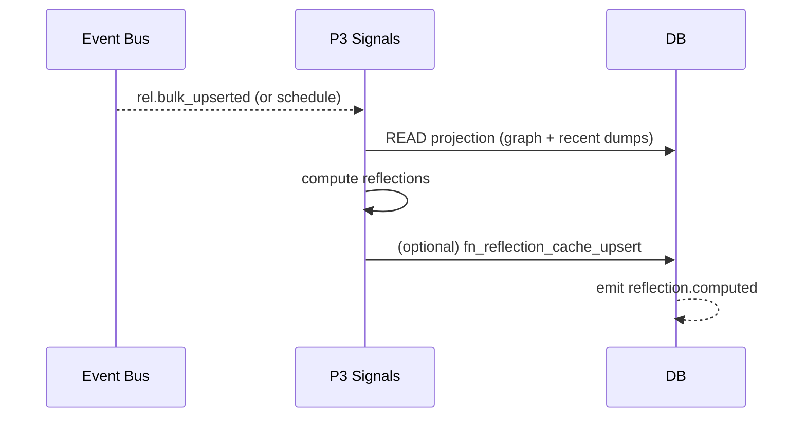
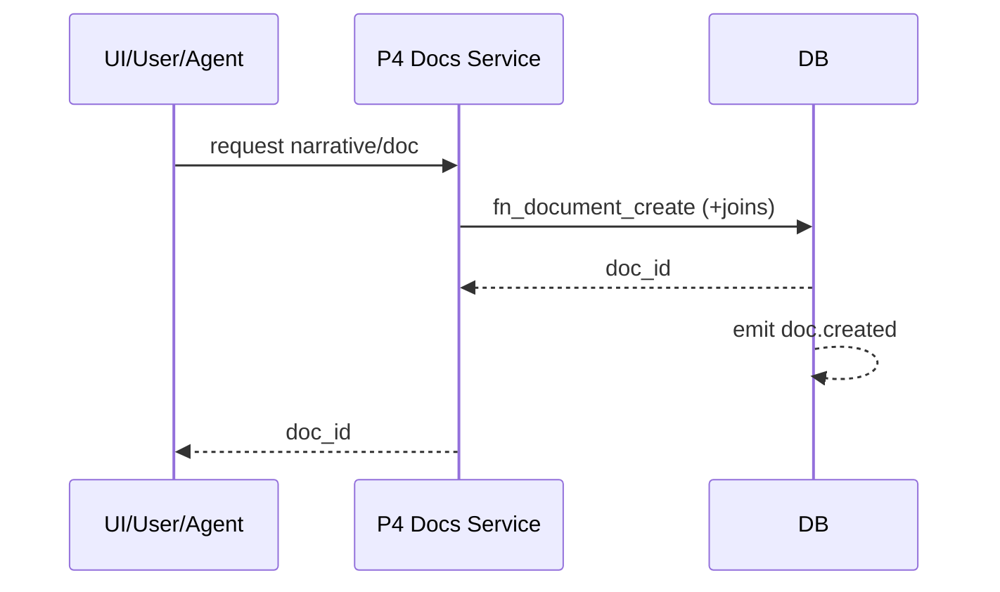

# Canon v2.0 — Substrate/Artifact Model
Pure substrate pipelines with artifact generation. Clear substrate/artifact boundaries.

# YARNNN_SUBSTRATE_RUNTIME.md
Version: 2.0
Status: Canon — Substrate/Artifact Boundaries

## Purpose
Operational runtime for Yarnnn with **strict pipeline separation** and **memory-first** discipline. Defines what each pipeline may/may-not do, allowed RPCs, event contracts, and verification.

Blocks (**context_blocks**) are structured knowledge ingredients extracted from raw_dumps by P1. Each block contains goals, constraints, metrics, entities, relationships, and provenance.

---

## Pipelines Overview

| Pipeline | Purpose | Allowed Writes | Disallowed | Emits |
|---|---|---|---|---|
| **P0 Capture** | Immutable ingestion of raw memory | `raw_dumps` | artifacts, relationships | `dump.created` |
| **P1 Substrate CRUD** | Create/update substrate atoms: **context_items**, **context_blocks** | `context_items`, `context_blocks`, proposals | artifacts, relationships | `block.proposed|accepted`, `context.tagged` |
| **P2 Graph Fabric** | Materialize substrate relationships | `substrate_relationships` | artifacts | `rel.bulk_upserted` |
| **P3 Artifact Gen** | Generate artifacts from substrate | `reflections_artifact`, `document_versions` | substrate writes | `reflection.computed`, `document.versioned` |
| **P4 Presentation** | Document composition and editing | `documents`, substrate_references | substrate writes | `doc.created|updated` |

> **Narrative is downstream (P4)**: it consumes substrate/graph; it is not part of substrate CRUD. If atomized "rememberable prose" is needed, use `context_item.kind='cue'` in P1.

---

## Allowed RPCs Matrix

| Pipeline | Allowed RPCs |
|---|---|
| P0 | `fn_ingest_dumps` |
| P1 | `fn_context_item_upsert_bulk`, `fn_block_create`, `fn_block_revision_create`, `fn_proposal_create`, `fn_proposal_approve`, `fn_proposal_reject` |
| P2 | `fn_relationship_upsert_bulk` |
| P3 | *(none)* `fn_reflection_cache_upsert` *(optional)* |
| P4 | `fn_document_create`, `fn_document_attach_block`, `fn_document_attach_context_item` |

---

## Memory Plane ↔ REST

| Storage (DB)       | API                                                      |
|--------------------|----------------------------------------------------------|
| timeline_events (append-only) | `GET /api/baskets/{id}/timeline` |
| reflection_cache (optional)   | `GET /api/baskets/{id}/reflections/latest` (may compute on read) |

---

## Consumes ⟷ Emits (Event Contracts)

| Pipeline | Consumes | Emits |
|---|---|---|
| P0 | — | `dump.created` |
| P1 | `dump.created` | `context.bulk_tagged`, `block.proposed|accepted|revised` |
| P2 | `dump.created`, `context.bulk_tagged`, `block.*` | `rel.bulk_upserted` |
| P3 | `rel.bulk_upserted` *(or schedule)* | `reflection.computed` *(if cached)* |
| P4 | user/agent action | `doc.created`, `doc.updated` |

**Event payloads (small)**  
- `dump.created`: `{ basket_id, dump_id, preview }`
- `context.bulk_tagged`: `{ basket_id, dump_id, counts_by_kind }`
- `block.proposed`: `{ basket_id, block_id, signature_hash }`
- `block.accepted`: `{ basket_id, block_id }`
- `block.revised`: `{ basket_id, block_id, revision_id }`
- `proposal.submitted`: `{ basket_id, proposal_id, proposal_kind, origin }`
- `proposal.approved`: `{ basket_id, proposal_id, ops_count }`
- `proposal.rejected`: `{ basket_id, proposal_id, reason }`
- `rel.bulk_upserted`: `{ basket_id, created, ignored }`
- `reflection.computed`: `{ basket_id, meta_derived_from }`
- `doc.created`: `{ basket_id, doc_id, document_type }`
- `doc.updated`: `{ basket_id, doc_id, document_type }`

---

## Sequence Diagrams

### P0 — Capture

### P1 — Substrate CRUD (Proposal-first)

### P2 — Graph Fabric

### P3 — Signals/Reflections

### P4 — Presentation

---

## Guardrails & Enforcement
- **Folder boundaries**: `api/pipelines/p0_capture`, `/p1_substrate`, `/p2_graph`, `/p3_signals`, `/p4_presentation`
- **RPC allow-lists** (per pipeline)
- **DB roles** (optional): `substrate_writer`, `graph_writer`, `derived_writer`, `presentation_writer`
- **CI check**: fail if a pipeline calls a forbidden RPC or writes disallowed tables.

---

## Acceptance (self-revealing)
- File exists and includes headings:
  - P0 Capture, P1 Substrate CRUD, P2 Graph, P3 Signals, P4 Presentation, Allowed RPCs, Consumes ⟷ Emits.
- Mermaid blocks render locally in preview.
- `rg -n "P0 Capture|P1 Substrate CRUD|Allowed RPCs|Consumes ⟷ Emits" docs/YARNNN_SUBSTRATE_RUNTIME.md`

---

## Commit
docs: add YARNNN_SUBSTRATE_RUNTIME with 5-pipeline boundaries, RPC matrix, and event contracts