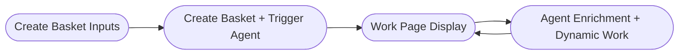

# docs/BASKET_DOMAINS.md

# yarnnn Basket Lifecycle Domains

- ** → For schema & authority rules see **Context Contract Model (First Principles)** ***

This document defines the canonical domains and flow for basket-related processes in Yarnnn. It is the source of truth for architecture, implementation, and documentation alignment.

---

## 🗂 **Domains**

---

### 1️⃣ **Create Basket — Inputs**

- **Purpose:**
    
    Faithfully collect and validate the user’s **intent material** — the initial raw_dump and optional files that will provide material for constructing the basket’s context contract.
    
- **What it handles:**
    - Raw text dump input (required)
    - File uploads (optional, e.g. images)
    - Optional basket name
    - Prepares payload: text + file URLs + name for persistence
- **Markdown handling:**
    - Preserves any Markdown syntax provided by the user as-is.
    - No parsing, formatting, or transformation — rendering occurs downstream.
- **What it does not handle:**
    - Creating basket or input records
    - Triggering agents
    - Proposing or structuring blocks

---

### 2️⃣ **Create Basket — Actual Creation + Agent Trigger**

- **Purpose:**
    
    Persist the basket and its initial intent material (raw_dump + files) in the database and initiate the orchestration agents responsible for proposing atomic context clauses (blocks).
    
- **What it handles:**
    - Creates `baskets` record (container for workspace constitution)
    - Creates `basket_inputs` (persists raw_dump + file references)
    - Triggers orchestration agents (e.g., `orch_block_manager_agent`)
    - Publishes events (e.g., `basket.compose_request`)
- **What it does not handle:**
    - Directly creating or promoting blocks (belongs to agent domain)
    - Rendering or assembling narrative views
    - User-facing workspace logic

---

### 3️⃣ **Baskets/[id]/work — Display Created Basket**

- **Purpose:**
    
    Render the basket’s current constitution of meaning to the user:
    
    - Raw input material (raw_dumps)
    - Approved + enforced blocks
    - Proposed change queue
- **What it handles:**
    - Narrative view with rendered Markdown (if present)
    - Surface current contract state: enforced (🔒/★) and proposed (□/■) blocks
    - Read-only audit trail of basket’s context state
- **What it does not handle:**
    - Persisting or mutating data
    - Running agents (except via explicit user triggers)
    - Proposing or modifying blocks directly

---

### 4️⃣ **Baskets/[id]/work — Agent Enrichment + Dynamic Work**

- **Purpose:**
    
    Evolve the basket’s context contract by parsing intent material, proposing new atomic clauses (blocks), and validating against existing enforced contracts.
    
- **What it handles:**
    - Parses raw_dumps + files
    - Proposes new blocks (state=PROPOSED)
    - Validates proposals against enforced blocks (LOCK/CONSTANT)
    - Populates change queue, recommends structural improvements
- **What it does not handle:**
    - Initial input collection
    - Direct basket or input record creation

---

## 🔄 **Canonical Flow Diagram**

---

## ⚡ **Summary**

> Yarnnn baskets represent evolving context contracts. The basket lifecycle reflects how intent material (raw_dumps) is transformed — via agent proposals and user approvals — into a defended constitution of meaning.
> 
> 
> All agent-driven enrichment happens under strict validation: no contradictions, no silent merges, no ambiguous context.
> 

---

*Last updated 2025‑06‑23 — aligned with Context Contract First Principles.*